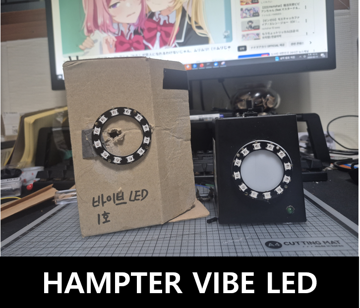

# HAMPTER VIBE LED

**HAMPTER VIBE LED**.  
An intelligent LED display controlled by **LLM**.

---

## 🛠 Hardware

- **MCU**: ESP32 (Recommended: Seeed XIAO ESP32C3)
- **LED**: WS2812B 12-Ring (Neopixel) - Pin: `D6`
- **Button**: Tactile Switch - Pin: `D9`
- **Power LED**: Status LED - Pin: `D10`
- **MCP LED**: Connection Status LED - Pin: `D4`

---

## 🔌 MCP TOOLS (LLM Control)

Tools used by the LLM to control this device.

### 1. `create_pattern`
- **Description**: Creates an LED pattern using mathematical formulas and saves it to a persistent NVS slot.
- **Arguments**:
  - `slot` (1~5): Slot number to save to.
  - `name`: Pattern name.
  - `hue`: Color formula (0~2π, radians).
  - `saturation`: Saturation formula (0~1).
  - `brightness`: Brightness formula (0~1).
- **Example**: "Create a rainbow pattern in slot 1. `hue=t+theta`, `sat=1`, `val=1`"

### 2. `change_slot`
- **Description**: Changes the active pattern slot.
- **Arguments**:
  - `slot`:
    - `0`: **IDLE (Default Mode)** - Eye blinking behavior.
    - `1~5`: Execute user-defined patterns.
    - `6`: **Blackout** - Turn off LEDs.
  - `duration`: Execution time (seconds). 0 means infinite loop.

### 3. `slot_status`
- **Description**: Retrieves the status (name, formulas) of all saved pattern slots.

---

## 📡 PORT TOOLS (Port Routing)

Ports for real-time data exchange with other sensors or devices.

### Input Ports (InPort)
- **`var_a`**, **`var_b`**, **`var_c`** (float): 
  - Channels for receiving external sensor values or data.
  - Can be used directly as variables `var_a`, `var_b`, `var_c` in pattern formulas.
  - Example: `brightness = var_a` (Brightness changes with `var_a` value)

---

## 🧮 Expression Syntax Guide

Syntax for formulas used in `create_pattern`.

### 1. Variables
| Variable | Description | Range |
|----------|-------------|-------|
| `t` | Time (seconds) | 0 ~ ∞ |
| `i` | LED Index | 0 ~ 11 |
| `theta` | LED Angle (radians) | 0 ~ 2π |
| `pi` | Pi (π) | 3.14159... |
| `var_a` | External Input A | float |
| `var_b` | External Input B | float |
| `var_c` | External Input C | float |

### 2. Operators
- **Arithmetic**: `+`, `-`, `*`, `/`, `%` (Remainder)
- **Comparison**: `<`, `>`, `<=`, `>=`, `==`, `!=` (True=1.0, False=0.0)
- **Logical**: `&&` (AND), `||` (OR), `!` (NOT)

### 3. Functions
| Function | Description |
|----------|-------------|
| `sin(x)`, `cos(x)`, `tan(x)` | Trigonometric functions |
| `abs(x)` | Absolute value |
| `sqrt(x)` | Square root |
| `floor(x)`, `ceil(x)` | Floor, Ceiling |
| `max(a,b)`, `min(a,b)` | Maximum, Minimum |
| `mod(a,b)` | Remainder (float) |
| `pow(a,b)` | Power (a^b) |

---

## 🧪 Advanced Pattern Recipes

Examples of complex patterns using the expression engine.

### 1. 🚨 Police Strobe
Alternating Red and Blue lights rotating over time.
- **Hue**: `(sin(t*10) > 0) * 0 + (sin(t*10) <= 0) * 4.2` (0=Red, 4.2≅240°=Blue)
- **Sat**: `1`
- **Val**: `(sin(t*20 + theta) > 0) * 1` (Fast rotating strobe effect)

### 2. ☄️ Spinning Comet
A single point rotating with a trailing tail.
- **Hue**: `t * 0.5` (Color changes slowly over time)
- **Sat**: `1`
- **Val**: `max(0, 1 - abs(mod(theta - t*5, 2*pi)))` (Brightness decreases based on angle difference)
  - *Tip: Use `mod` function to cycle the angle for rotation.*

### 3. 🔊 Sound Reactive Pulse
Brightness and color react to external sound volume (`var_a`).
- **Hue**: `3.0 + (var_a * 0.5)` (Base cyan color shifts to purple as volume increases)
- **Sat**: `1`
- **Val**: `var_a * (sin(t*5)+1)/2` (Brightness oscillates proportional to volume)

### 4. 🧬 Bio Rhythm
Twp sine waves interfering to create complex patterns.
- **Hue**: `sin(t) + sin(theta)`
- **Sat**: `0.8`
- **Val**: `(sin(t*3 + theta) * cos(theta - t)) + 0.5`

---

## 🔄 State Machine

### 1. IDLE Mode (Eye Mode)
- **Entry**: Boot, `change_slot(0)`, or pattern timeout.
- **Behavior**: Organic eye blinking (Closing -> Hold -> Opening).
- **Moods**: `Neutral` (Green), `Annoyed` (Yellow), `Angry` (Red).

### 2. PATTERN Mode (Active Mode)
- **Entry**: `change_slot(1~5)` called.
- **Behavior**: Executes `DynamicPattern` formulas.

### 3. SLEEP Mode (Power Off)
- **Entry**: Long press button (1 second).
- **Behavior**: All LEDs off, standby state.

---

## 🕹 Button Control

- **Short Press**: Cycle patterns (0 -> 1 -> ... -> 5 -> 0).
- **Long Press**: Power On/Off (Sleep).

